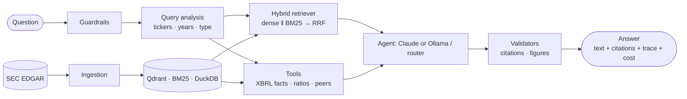

# FinSight

**A grounded, citation-first financial research assistant** — hybrid RAG over SEC filings,
deterministic XBRL analytics, and a tool-using agent (Claude, or a free local model via Ollama —
ADR-0011), with an evaluation harness that reports confidence intervals and admits where the
system is weak.

[](https://github.com/your-username/finsight/actions)


> **Status:** all eight phases are built and tested against real SEC data (12 companies,
> 60 10-Ks, 23,221 chunks, 9,146 XBRL facts). The same `ResearchAgent` tool loop that would run
> Claude has been **run live for the first time against a free, local model** (`--llm ollama`,
> `llama3.2:3b`, ADR-0011) — no API key needed, `finsight doctor` checks it. **`--llm claude`
> itself remains unrun** (no API key available); the two must not be conflated — see
> [what is and isn't measured](#what-is-and-isnt-measured).

---

## The idea

A general chatbot asked *"How did Apple's gross margin change over three years and why?"* will invent
numbers, do arithmetic in its head, and cite nothing. In finance a wrong number is worse than no answer.
FinSight splits the problem by **what kind of truth each part needs**:

| Part of an answer | Source of truth | Mechanism |
|---|---|---|
| **Numbers** (revenue, margins, ROE…) | SEC **XBRL** structured facts | Deterministic tools + tested calculators — the model never does the maths |
| **Explanations** (drivers, risks, strategy) | Text of the 10-K | Hybrid retrieval (dense + BM25 → RRF) with **validated citations** |
| **Trust** | Evaluation | Reproducible harness: retrieval, numeric accuracy, abstention, cost, latency — with confidence intervals |

It **abstains** when evidence is missing and **declines** requests for investment advice.

## Results

Every number below is generated by `scripts/collect_results.py` from files written by
`finsight eval …`; nothing is typed by hand. The gold set is **automatically derived** (numeric answers
are correct by construction; it is *not* human-verified) — [read the caveats](docs/EVALUATION.md#21-what-gold_v1-actually-is).

<!-- RESULTS:START -->
### End-to-end accuracy on `gold_v1` (rule-based: numbers, names, abstention)

| System | dev accuracy [95% CI] | **test** accuracy [95% CI] | abstention F1 (test) | p50 ms | $/query |
|---|---|---|---|---|---|
| Single-shot RAG (extractive quoting, no LLM) | 0.275 [0.174, 0.377] | 0.206 [0.088, 0.353] | 0.83 | 613 | $0 (no LLM) |
| Tool router (XBRL tools + extractive fallback, no LLM) | 0.942 [0.884, 0.986] | 0.941 [0.853, 1.000] | 0.83 | 86 | $0 (no LLM) |
| Claude agent (tools + LLM) | not run: no API key | not run | - | - | - |
| Agent (llama3.2:3b via Ollama, free & local - see below) | see below | see below | - | - | $0 |

Accuracy by question type on the **test** split (exploratory: few questions per type):

| Type | RAG | Router |
|---|---|---|
| comparison | 0.000 | 1.000 |
| computed_metric | 0.125 | 1.000 |
| fact_lookup | 0.000 | 0.000 |
| numeric | 0.143 | 1.000 |
| out_of_scope | 1.000 | 1.000 |
| trend | 0.000 | 1.000 |

### Citation hygiene (answers with a valid citation and no flagged claim/figure)

Accuracy alone hides this: a fluent answer can score correct on the numbers it states while citing nothing, or citing a source that does not exist. The router's text fallback and the free local agent both score far below the extractive baseline (which can only ever quote, so it is close to 100% by construction) - this is the more honest read of how "grounded" each system actually is, and it is not visible in the accuracy tables above. "Citing a source that does not exist" is still counted as a failure here either way, but it no longer reaches the reader looking like a real citation: any label the model writes that this run cannot back up is rewritten to `[unverified]` before the answer leaves the pipeline (`generation/citations.py::repair_citations`, ERROR_ANALYSIS.md row 26) - confirmed to leave these numbers unchanged by re-running the natural-phrasing probe after the fix. **The agent row's test column reflects three further fixes** (`agent/tools.py::_register_fact` giving XBRL facts a real citation; a `computed_metric` tool-selection fix; then `generation/citations.py::attribute_claims` giving a genuinely-paraphrased-but-unbracketed claim a real citation instead of leaving it uncited - ERROR_ANALYSIS.md 3d/3e/3f): test accuracy rose 0.735 -> 0.853 and citation hygiene 0.0% -> 55.0% with zero new regressions at any stage (paired per-question diff against the immediately prior run each time). **The dev column has not been re-measured against any of the three** - expect a comparable rise, not the value shown.

| System | dev | test |
|---|---|---|
| Single-shot RAG (extractive) | 96.6% | 100.0% |
| Tool router | 36.8% | 38.6% |
| Agent (llama3.2:3b via Ollama, free & local) | 4.2% | 55.0% |

### Retrieval (section-level; no LLM), default config = hybrid, rerank off

| split | filters | recall@8 [95% CI] | MRR | nDCG@8 |
|---|---|---|---|---|
| dev (n=29) | on | 0.897 [0.793, 1.000] | 0.614 [0.469, 0.755] | 0.346 [0.257, 0.442] |
| **test (n=15)** | on | 0.567 [0.333, 0.800] | 0.445 [0.219, 0.686] | 0.267 [0.121, 0.421] |
| test (n=15) | off | 0.367 [0.133, 0.600] | 0.198 [0.042, 0.386] | 0.083 [0.022, 0.158] |

### Zero-cost evaluation: the agent against a free, local model (`--llm ollama`, no API key)

Model `llama3.2:3b` via Ollama (ADR-0011), `temperature=0`/`seed=0`, one Apple Silicon laptop, `--workers 1`. This measures *this specific 3B local model*, not an upper bound on the LLM agent - `--llm claude` remains unmeasured (see EVALUATION.md 1.1). Full traces: `reports/runs/*-agent-ollama-*`. **Read this alongside citation hygiene above: the accuracy numbers below do not reflect how often the agent actually grounds its answer.**

| System | dev accuracy [95% CI] | test accuracy [95% CI] | abstention F1 (test) | p50 ms | $/query |
|---|---|---|---|---|---|
| Agent (llama3.2:3b via Ollama, free & local) | 0.768 [0.667, 0.870] | 0.853 [0.735, 0.971] | 0.88 | 11687 | $0 (free local model) |
| Tool router (for reference, no LLM) | 0.942 [0.884, 0.986] | 0.941 [0.853, 1.000] | 0.83 | 86 | $0 (no LLM) |
| Single-shot RAG (extractive, for reference, no LLM) | 0.275 [0.174, 0.377] | 0.206 [0.088, 0.353] | 0.83 | 613 | $0 (no LLM) |

Accuracy by question type on the **test** split, agent-ollama vs router:

| Type | Agent (Ollama) | Router |
|---|---|---|
| comparison | 0.000 | 1.000 |
| computed_metric | 0.625 | 1.000 |
| fact_lookup | 1.000 | 0.000 |
| numeric | 1.000 | 1.000 |
| out_of_scope | 1.000 | 1.000 |
| trend | 1.000 | 1.000 |

On the templated `gold_v1` test split:

* **agent-ollama vs router** (`gold_v1` templated test split): n=34 shared questions, accuracy 0.853 vs 0.941, paired difference -0.088 [-0.235, 0.059] (not distinguishable), McNemar exact p=0.4531
* **agent-ollama vs single-shot RAG (extractive)** (`gold_v1` templated test split): n=34 shared questions, accuracy 0.853 vs 0.206, paired difference 0.647 [0.471, 0.824] (statistically distinguishable), McNemar exact p=0.0000

On the 38-question natural-phrasing probe (same file and current code as the router/RAG baselines above, so this is a same-moment, apples-to-apples comparison):

* **agent-ollama vs router** (natural phrasing, `gold_v2_draft`): n=26 shared questions, accuracy 0.885 vs 0.846, paired difference 0.038 [-0.115, 0.192] (not distinguishable), McNemar exact p=1.0000
* **agent-ollama vs single-shot RAG (extractive)** (natural phrasing, `gold_v2_draft`): n=26 shared questions, accuracy 0.885 vs 0.423, paired difference 0.462 [0.269, 0.654] (statistically distinguishable), McNemar exact p=0.0005


### Templated vs natural phrasing (`gold_v2_draft`, 38 questions, unverified draft labels)

| System | `gold_v1` templated | natural, **before** the guardrail fix (clean) | natural, after the fix (**in-sample**) |
|---|---|---|---|
| Single-shot RAG | 0.206 [0.088, 0.353] (test) | **0.269 [0.115, 0.423]** (abstention F1 0.50) | 0.423 [0.231, 0.615] (abstention F1 0.88) |
| Tool router | 0.941 [0.853, 1.000] (test) | **0.692 [0.500, 0.846]** (abstention F1 0.50) | 0.846 [0.692, 0.962] (abstention F1 0.88) |

The middle column is the clean measurement: numeric expectations come from the XBRL store and it was taken before any system change was made in response to these questions. The probe then exposed a hole in the advice guardrail (all 4 naturally phrased advice requests slipped through; abstention recall 3/9 -> 7/9 after the fix), which was fixed and the probe re-run. That last column is **in-sample** (the fix was designed from those very questions) and shows the fix works, not how well it generalises. Retrieval on the natural questions (n=12 with gold sources, filters on): recall@8 0.625 [0.375, 0.833], hit@8 0.750 [0.500, 1.000]; text-question section labels in this file are unverified draft judgement.

### Ablation A1: retrieval mode (dev split)

| Preset | recall@8 [95% CI] | MRR | nDCG@8 | p50 ms | p95 ms | Δ vs dense_only [95% CI] |
|---|---|---|---|---|---|---|
| dense_only | 0.707 [0.534, 0.862] | 0.448 | 0.275 | 157 | 171 | - |
| bm25_only | 0.897 [0.793, 0.983] | 0.643 | 0.302 | 1 | 1 | 0.190 [-0.017, 0.414] |
| hybrid | 0.897 [0.793, 1.000] | 0.614 | 0.346 | 159 | 191 | 0.190 [0.034, 0.362] * |
| hybrid_rerank | 0.897 [0.759, 1.000] | 0.687 | 0.434 | 2484 | 2795 | 0.190 [0.034, 0.362] * |
| hybrid_rerank_wide | 0.931 [0.828, 1.000] | 0.695 | 0.449 | 4390 | 5960 | 0.224 [0.086, 0.379] * |

`*` = paired-bootstrap 95% CI of the difference excludes zero (n=29 questions).

### Ablation A2/A3 (BM25 half): chunk size and overlap (dev split)

BM25-only, dev split (n=29), contextual header on, section-level scoring.

| Preset | recall@8 [95% CI] | MRR | nDCG@8 | p50 ms | p95 ms | Δ vs chunk400_overlap15 (default) [95% CI] |
|---|---|---|---|---|---|---|
| chunk200_overlap15 | 0.879 [0.759, 0.983] | 0.690 | 0.379 | 1 | 1 | -0.017 [-0.138, 0.103] |
| chunk400_overlap15 (default) | 0.897 [0.793, 0.983] | 0.646 | 0.302 | 1 | 1 | - |
| chunk800_overlap15 | 0.828 [0.690, 0.966] | 0.527 | 0.251 | 0 | 0 | -0.069 [-0.190, 0.017] |
| chunk400_overlap0 | 0.914 [0.810, 1.000] | 0.674 | 0.315 | 1 | 1 | 0.017 [-0.086, 0.121] |
| chunk400_overlap30 | 0.776 [0.621, 0.914] | 0.597 | 0.285 | 1 | 1 | -0.121 [-0.241, -0.017] * |

`*` = paired-bootstrap 95% CI of the difference excludes zero (n=29 questions).

Index size:

* `chunk200_overlap15`: 38,120 chunks
* `chunk400_overlap15 (default)`: 23,221 chunks
* `chunk800_overlap15`: 17,421 chunks
* `chunk400_overlap0`: 22,686 chunks
* `chunk400_overlap30`: 23,856 chunks

The dense half (embeddings) was **not** measured: re-embedding costs ~35 minutes per configuration.

### Ablation A4 (BM25 half): contextual header (dev split)

| Preset | recall@8 [95% CI] | MRR | nDCG@8 | p50 ms | p95 ms | Δ vs bm25_no_header [95% CI] |
|---|---|---|---|---|---|---|
| bm25_no_header | 0.586 [0.414, 0.759] | 0.352 | 0.160 | 0 | 1 | - |
| bm25_with_header | 0.897 [0.793, 0.983] | 0.646 | 0.302 | 0 | 1 | 0.310 [0.155, 0.483] * |

`*` = paired-bootstrap 95% CI of the difference excludes zero (n=29 questions).

### Ablation A7: how many chunks to retrieve (dev split)

Hybrid, rerank off, filters on, dev split (n=29). Approx. context cost assumes ~300 tokens/chunk.

| k | recall@k [95% CI] | hit@k | approx. context tokens |
|---|---|---|---|
| 1 | 0.448 [0.276, 0.621] | 0.483 | ~300 |
| 3 | 0.672 [0.500, 0.828] | 0.690 | ~900 |
| 5 | 0.759 [0.603, 0.897] | 0.793 | ~1,500 |
| 8 | 0.897 [0.793, 1.000] | 0.897 | ~2,400 |
| 12 | 0.914 [0.810, 1.000] | 0.931 | ~3,600 |
| 16 | 0.983 [0.948, 1.000] | 1.000 | ~4,800 |

### API load test (one worker, localhost, no LLM)

Machine: arm64 / Darwin, 8 logical cores, 16 GB; localhost; ONE uvicorn worker; real index (23,221 chunks); no LLM calls. Requests per cell shown in `n`.

| workload | concurrency | n | req/s | p50 ms | p95 ms | max ms | errors |
|---|---|---|---|---|---|---|---|
| router: numeric question (XBRL tool) | 1 | 96 | 52.6 | 18 | 21 | 46 | 0 |
| router: numeric question (XBRL tool) | 4 | 96 | 77.6 | 49 | 84 | 90 | 0 |
| router: numeric question (XBRL tool) | 16 | 96 | 31.0 | 471 | 831 | 856 | 0 |
| rag: text question (hybrid retrieval + extractive) | 1 | 48 | 5.8 | 172 | 173 | 216 | 0 |
| rag: text question (hybrid retrieval + extractive) | 4 | 48 | 6.7 | 598 | 669 | 803 | 0 |
| rag: text question (hybrid retrieval + extractive) | 16 | 48 | 6.5 | 2320 | 3396 | 3408 | 0 |
| GET financials (DuckDB read) | 1 | 96 | 50.9 | 19 | 19 | 56 | 0 |
| GET financials (DuckDB read) | 4 | 96 | 81.2 | 48 | 71 | 93 | 0 |
| GET financials (DuckDB read) | 16 | 96 | 43.0 | 332 | 516 | 611 | 0 |

## Reading the numbers

* **Single-request latency is small**: 18 ms (router numeric), 19 ms (DuckDB read), 172 ms (hybrid
  retrieval: one query embedding + dense + BM25 + RRF).
* **Throughput peaks at concurrency 4 for the cheap endpoints (~78-81 req/s) and *falls* at 16
  (31-43 req/s)**: past the knee, added concurrency only adds queueing. Tail latency at 16 is
  ~25x the p50 at 1 for the router. This is the signature of a serialised critical section
  (`db_lock` around DuckDB, deliberately added after a thread-safety race - see ERROR_ANALYSIS)
  plus one Python process, not of the network. I have not profiled to confirm which of the two
  dominates; treat that as a hypothesis.
* **The RAG path saturates at ~6-7 req/s regardless of concurrency**: it is CPU-bound in the
  embedding model and BM25 scoring, so more client threads only lengthen the queue
  (p50 2.3 s at 16).
* **Zero errors in all 9 cells** (rate limiter raised via `FINSIGHT_API_RATE_LIMIT`; the default of
  30/min per client is intentionally far below these rates).

Scope limits: localhost, one uvicorn worker, no LLM calls (the extractive backend), a single
question per workload (so caches are warm), 48-96 requests per cell. It shows where the design
saturates, not what a production deployment would sustain. Scaling paths are in
`docs/LIMITATIONS.md` (multiple workers need the Qdrant *server* - embedded mode is single-process).
<!-- RESULTS:END -->

### What the evidence says

1. **Numbers should come from tools, not text.** Answering numeric questions from retrieved passages
   scores ~0.2; the same questions through XBRL tools score ~0.94 on the **held-out test companies**
   (paired difference +0.73, 95% CI [0.59, 0.88]; 25 questions only the tools get right, none the
   other way). *Caveat, now measured:* the router's rules were developed against the gold set's
   templated phrasing. On 38 differently-worded questions (`gold_v2_draft`, taken before any fix) the
   router scores **0.69** [0.50, 0.85], not 0.94, while the retrieval baseline stays near 0.27 - the
   gap survives natural phrasing, but the 0.94 was optimistic. The natural probe also found the
   advice guardrail let all 4 naturally phrased advice requests through (abstention recall 3/9); it is fixed (7/9), and that re-run is flagged in-sample.
2. **The contextual header is worth it.** Prefixing each chunk with `company | form FY | Item` lifts BM25
   recall@8 from 0.586 to 0.897 (paired CI [+0.155, +0.483]) — and explains much of BM25's edge over
   dense retrieval on these templated questions.
3. **The reranker did not earn its default slot.** It improves ordering (nDCG@8 0.35 → 0.43) but not
   recall@8, at ~16× the latency (2.5 s vs 0.16 s). Since the model sees all 8 passages regardless of
   order, it is opt-in (`hybrid_rerank` preset). With n = 29 dev questions this is a cost argument, not a
   significance claim.
4. **Retrieval generalises worse than the dev number suggests.** Recall@8 is 0.90 on dev but **0.57 on the
   held-out test companies** (n = 15, wide interval). Error analysis: all 9 misses are "right filing,
   wrong section" — JPMorgan files its real MD&A under Item 15, and generic questions ("describe the
   business") legitimately match MD&A text. Metadata filters are worth +0.20 recall on test. I did **not**
   tune to fix these (see [error analysis](docs/ERROR_ANALYSIS.md)); note that test failures were inspected,
   so that split is no longer a clean holdout.
5. **Chunk size and overlap are not sharply tuned - and the 15% overlap is unproven.** On BM25 (dense
   half not measured: ~35 min per re-embed), 200- and 800-token chunks are statistically
   indistinguishable from 400, and *no* overlap scores 0.914 vs 0.897 for the 15% default (CI of the
   difference [-0.086, +0.121]). Only 30% overlap is reliably worse (-0.121, CI excludes 0). The default
   was chosen on convention, not on this evidence.
6. **How many chunks to retrieve.** Recall@k on dev climbs 0.45 (k=1) -> 0.90 (k=8) -> 0.98 (k=16), so
   k=8 (~2,400 context tokens) is a cost/coverage compromise rather than a plateau.
7. **Capacity is modest and measured.** One worker on a laptop: ~80 req/s for XBRL/DuckDB endpoints
   (peaking at concurrency 4), ~6-7 req/s for hybrid-retrieval questions, zero errors; throughput
   *falls* past the knee. See the [load test](reports/load_test.md) for scope limits.
8. **The extractive baseline over-answers.** It quotes any passage sharing words with an unanswerable
   question ("current share price today" → a buyback table). That is the dangerous failure an LLM's
   abstention behaviour is meant to fix — and it is unmeasured until the Claude agent is run.

## Architecture



Details, sequence diagrams and the data model: [docs/ARCHITECTURE.md](docs/ARCHITECTURE.md).

## Quickstart

Requires Python ≥ 3.11 (developed on 3.13). Ingestion needs a contact email for SEC's fair-access policy.

```bash
git clone <this repo> && cd finsight
make install-all                       # venv + every extra
cp .env.example .env                   # then set FINSIGHT_SEC__USER_AGENT="Your Name you@example.com"

finsight ingest                        # 60 10-Ks + XBRL facts from SEC EDGAR (~30 s, cached)
finsight coverage --write docs/coverage.md
finsight process                       # parse + chunk -> data/processed/chunks.parquet (~20 s)
finsight index                         # embed 23k chunks with BGE-small (~35 min on an M1 CPU; resumable)
finsight eval gold                     # build the 147-question gold set

finsight ask "What was Apple's revenue in fiscal 2024?" --llm extractive     # no API key needed
finsight eval run --system router --split test                              # score a system
python scripts/collect_results.py --readme                                  # refresh the results block

finsight serve &  finsight ui          # API on :8000, Streamlit on :8501
```

**Try the actual LLM agent for free**, no API key (ADR-0011) - CLI, or the API and web UI (ADR-0012):

```bash
brew install ollama && brew services start ollama && ollama pull llama3.2:3b   # ~2 GB, one time
finsight doctor                                                                 # confirms it's reachable
finsight ask "What was Apple's revenue in fiscal 2024?" --llm ollama --system agent
finsight eval run --system agent --llm ollama --split test --workers 1 --name agent-ollama-test

finsight serve --llm ollama &  finsight ui   # /readyz shows llm_provider: "ollama (llama3.2:3b)"
# open http://localhost:8501/Ask, pick mode "agent" - answers cost $0.0000, verified live end to end
```

With an Anthropic key (`ANTHROPIC_API_KEY` or `ant auth login`) the same commands run Claude instead:
`finsight ask "..." --llm claude --system agent`, `finsight eval run --system agent --llm claude`.
This has not been done on the machine this was built on - see [what is and isn't measured](#what-is-and-isnt-measured).

**Docker** (API + UI + Qdrant server): `docker compose up --build` — see [docker-compose.yml](docker-compose.yml).
Not run on the machine this was built on (no Docker); the files are validated statically in the test suite.

## Status

| Phase | Theme | Status |
|---|---|---|
| 0 | Foundations: typed config & schemas, CLI, CI, docs | ✅ |
| 1 | Data layer: EDGAR client, XBRL facts, DuckDB, coverage | ✅ |
| 2 | Parsing & section-aware chunking | ✅ |
| 3 | Indexing & hybrid retrieval | ✅ |
| 4 | Grounded generation, citations, guardrails | ✅ |
| 5 | Evaluation harness, gold set, ablations | ✅ |
| 6 | Agent & financial analytics | ✅ |
| 7 | API (FastAPI) & UI (Streamlit) | ✅ |
| 8 | Docker, CI regression gate, docs, notebooks | ✅ |

[Roadmap and per-phase details](docs/ROADMAP.md).

## What is and isn't measured

| Measured with real data | Measured live, **free local model only** (`--llm ollama`) | Implemented and unit-tested, **not** run live |
|---|---|---|
| XBRL parsing vs 14 published figures; 0 unexplained gaps; identity holds in 278 periods | `ResearchAgent` tool loop: dev + test + the natural-phrasing probe, all vs the router (ERROR_ANALYSIS 3c) | `--llm claude` specifically; LLM judge; refusal-fallback request shape |
| Section detection: 60/60 filings yield all core Items | 12-question manual smoke test across 5 categories (`scripts/smoke_test_agent.py`) | Docker images / compose stack |
| API load test (no LLM), 785 hermetic tests, 6 import-linter contracts | `finsight serve --llm ollama` end to end: `/readyz`, a real `/v1/query`, and the Streamlit Ask page in a browser (ADR-0012) - not load-tested with an LLM in the loop |  |
| Retrieval ablations, header ablation, metadata-filter effect |  | Streaming beyond replayed trace events |
| Tool router vs RAG, paired, on held-out companies |  | Human-verified gold set (`gold_v2`) |

A free local model is not Claude - `llama3.2:3b` is roughly 1/50th the parameter count. Results in
the middle column are evidence about the *architecture* (does the tool loop work end to end, does
it ground and cite, does it abstain), not a preview of `--llm claude`'s quality or cost.

## Repository tour

```
configs/          universe.yaml (12 companies, known gaps, pinned CIK) · retrieval.yaml (ablation presets)
data/             raw → processed → indexes (git-ignored) · eval/gold_v1.jsonl (tracked)
docs/             DESIGN · ARCHITECTURE · DATA · EVALUATION · ERROR_ANALYSIS · LIMITATIONS · ROADMAP · coverage · adr/
notebooks/        01 data quality · 02 corpus EDA · 03 peer analysis · 04 retrieval error analysis   (executed, outputs committed)
reports/          RESULTS.md · ablation tables · per-run summaries
scripts/          build_notebooks · collect_results · make_regression_fixture · ablation_header_bm25
src/finsight/
  ingestion/      rate-limited, cached EDGAR client · XBRL facts · DuckDB store · quality checks
  processing/     iXBRL cleaning · Item splitting · tables · section-aware chunking · contextual headers
  indexing/       embeddings · Qdrant · BM25 · resumable builder + manifest
  retrieval/      query analysis · dense · sparse · RRF · rerank · Retriever facade
  generation/     Claude + Ollama wrappers · prompts · context · citations · figure verification · RAG pipeline
  analytics/      ratios · DuPont + attribution · trends · peers · risk-factor diff · tone
  agent/          tools · deterministic router · LLM research agent
  evaluation/     gold builder · metrics · runners · ablation · bootstrap stats · judges · reports
  api/  ui/       FastAPI service · Streamlit app
tests/            unit (hermetic) · integration (real data, retrieval regression gate)
```

## Engineering practices

* **Typed and strict** — `mypy --strict`, frozen Pydantic models with `extra="forbid"`.
* **Hermetic tests** — embedder, vector store, LLM and HTTP sit behind protocols with fakes; CI needs no
  network, model download or API key. Property-based tests (Hypothesis) cover the fiscal calendar, rate
  limiter, chunker and DuPont identity.
* **Regression gate in CI** — retrieval quality on 182 real 10-K passages must stay above a committed baseline.
* **Bugs caught by tests and real data** are written up in
  [docs/ERROR_ANALYSIS.md](docs/ERROR_ANALYSIS.md) (XOM's reorganised CIK, leaking hidden iXBRL text, a
  DuckDB thread-safety race, years read as $2 B, a "clean" check that was joining nothing, …).
* **Polite by construction** — one rate limiter enforces SEC's fair-access policy; credentials are never
  part of settings or logs.
* **Decisions recorded** — [ten ADRs](docs/adr/) with alternatives and consequences.

## What this demonstrates

| Skill area | Where to look |
|---|---|
| **AI / ML engineering** — hybrid retrieval, tool-using agents, prompt caching, guardrails, serving | `retrieval/`, `generation/`, `agent/`, `api/` |
| **Data science** — evaluation design, bootstrap CIs, paired tests, ablations, error analysis, honest limits | `evaluation/`, `docs/EVALUATION.md`, `docs/ERROR_ANALYSIS.md` |
| **Data analysis / SQL** — DuckDB analytics, data-quality checks, restatement analysis, EDA notebooks | `ingestion/xbrl/`, `notebooks/01`, `notebooks/02` |
| **Financial analysis** — ratios, DuPont attribution, peer benchmarking, fiscal-period alignment, XBRL semantics | `analytics/`, `notebooks/03`, `docs/DATA.md` |
| **Software engineering** — architecture, typing, testing strategy, CI, config, observability, Docker | whole repo |

## Documentation

[Design](docs/DESIGN.md) · [Architecture](docs/ARCHITECTURE.md) · [Data & known traps](docs/DATA.md) ·
[Evaluation](docs/EVALUATION.md) · [Error analysis](docs/ERROR_ANALYSIS.md) · [Limitations](docs/LIMITATIONS.md) ·
[Roadmap](docs/ROADMAP.md) · [Coverage report](docs/coverage.md) · [ADRs](docs/adr/README.md) ·
[Portfolio guide](docs/PORTFOLIO.md) · [Load test](reports/load_test.md)

## Disclaimer

FinSight is a research tool built on public SEC filings. It provides **information, not investment
advice**, and may contain errors — verify against the cited source passage.

## License

MIT — see [LICENSE](LICENSE).
