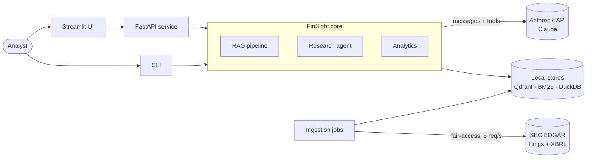
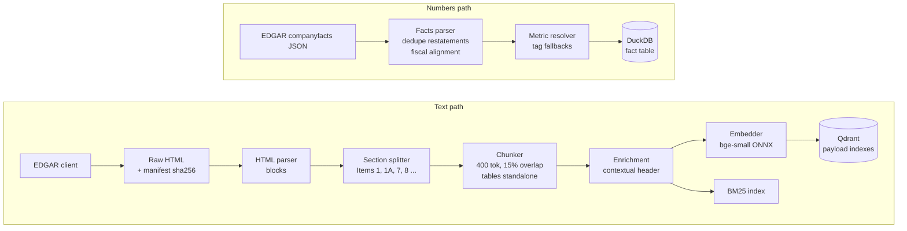
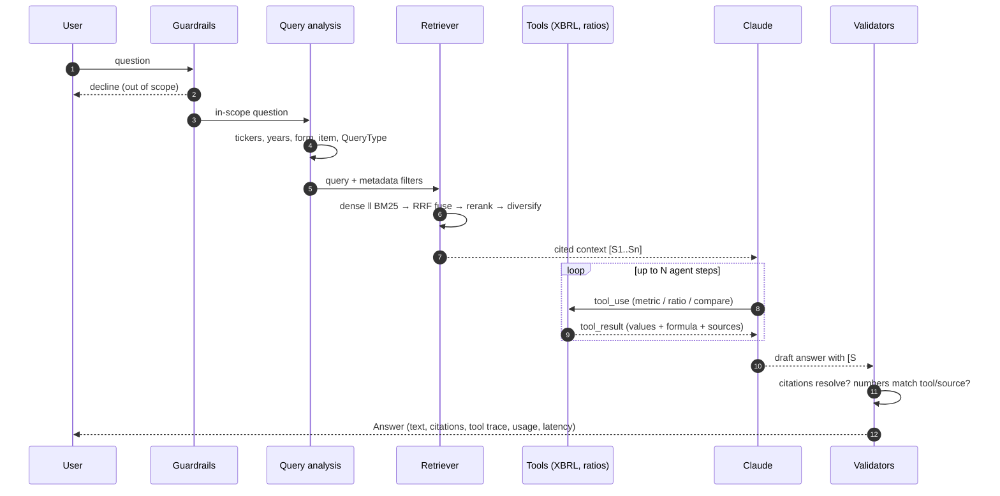
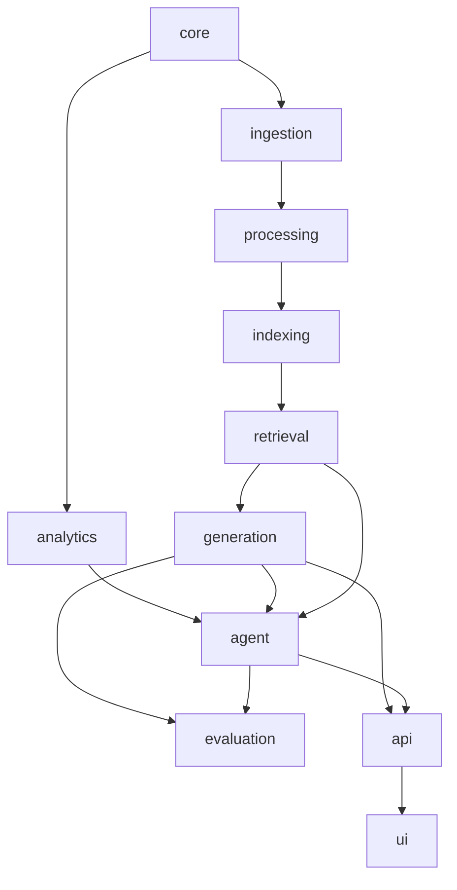
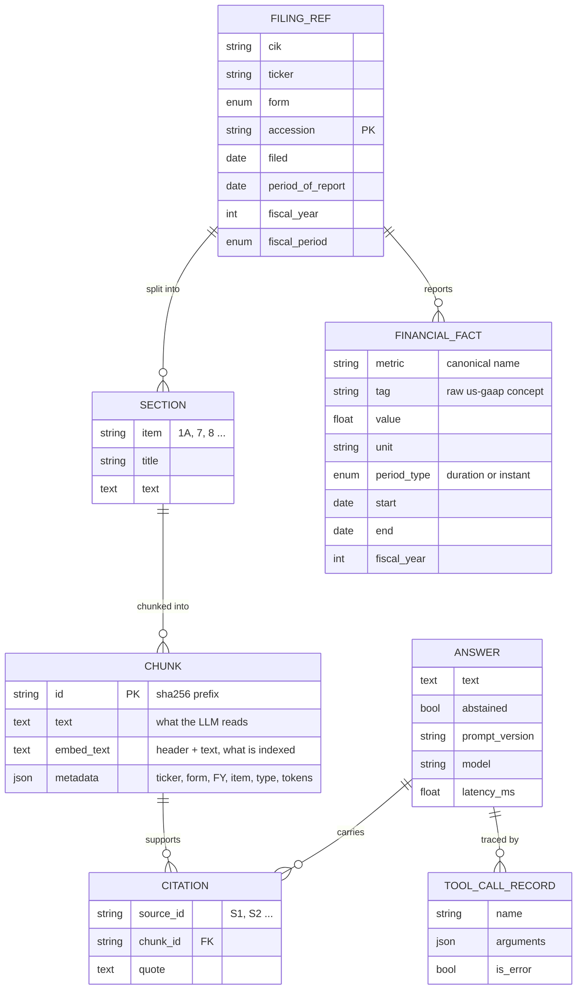
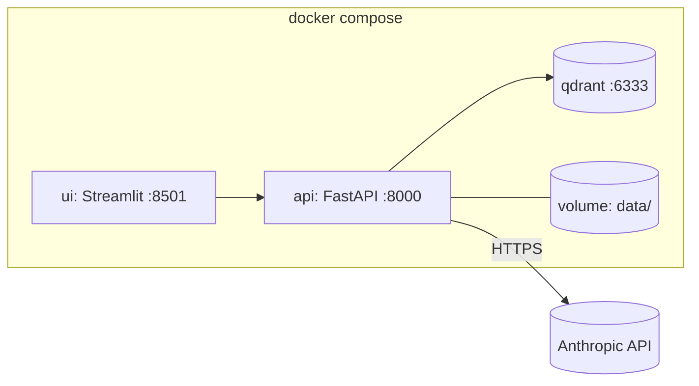

# FinSight — Architecture

Diagrams render natively on GitHub (Mermaid). Rationale for each choice: [DESIGN](DESIGN.md)
and [`adr/`](adr/).

## 1. System context



## 2. Two planes

### 2.1 Offline plane — build the knowledge base



### 2.2 Online plane — answer a question



The single-shot **RAG baseline** is this flow without the tool loop. The **agent** adds the loop.
Both return the same `Answer` type, so the evaluation harness scores them interchangeably.

## 3. Package layout and dependency rules

```
src/finsight/
├── config/        settings (env) · universe & preset loaders (YAML)
├── core/          schemas · exceptions · logging · telemetry           ← imports nothing internal
├── ingestion/     edgar/ · xbrl/ · market/ · pipeline                  ← core, config
├── processing/    html_parser · sections · tables · chunking · enrichment
├── indexing/      embeddings · vector_store · sparse_index · builder
├── retrieval/     query_analysis · dense · sparse · hybrid · rerank · retriever
├── generation/    llm (Claude) · ollama (free, local) · offline (extractive) · prompts · context ·
│                  citations · guardrails · pipeline
├── analytics/     ratios · dupont · trends · peers · risk_diff · sentiment   ← pure functions
├── agent/         tools · orchestrator · trace
├── evaluation/    datasets · metrics/ · judges · runner · ablation · stats · report
├── api/           FastAPI app, routers, schemas, middleware
├── ui/            Streamlit app, pages, components
└── cli.py         Typer entrypoint
```

**Dependency direction** (a layer may import only from layers to its left/above):



Rules, enforced by `make arch` (import-linter contracts in `pyproject.toml`, run in CI; each contract
was checked to *fail* on an injected violation, so a pass means something):

1. `core` and `analytics` import **nothing** from other FinSight packages (analytics is pure).
2. `ingestion` and `processing` never import `retrieval`, `generation` or `agent`.
3. `RetrievalFilters` lives in `core`, not `retrieval`: `indexing` needs it to pre-filter and
   `retrieval` depends on `indexing`, so keeping it in `retrieval` made a package cycle (found by the
   linter's first draft, fixed by moving the value object). Heavy third-party SDKs (`anthropic`,
   `qdrant_client`, `duckdb`) are each imported from exactly one module.
4. `evaluation` depends on pipelines only through the `Answer`-returning interface — it never
   reaches into their internals.
5. `api` and `ui` contain no business logic; they translate and render.
6. Everything external (embedder, vector store, LLM, HTTP) is behind a `Protocol` so tests inject
   fakes.

## 4. Data model



All of these are frozen Pydantic models in [`core/schemas.py`](../src/finsight/core/schemas.py).

## 5. Storage layout on disk

```
data/
├── raw/edgar/<cik>/<accession>/      primary HTML + manifest.json (sha256, url, fetched_at)
├── raw/xbrl/<cik>.json               companyfacts snapshot (cached, ETag-aware)
├── interim/sections/<accession>.jsonl
├── processed/
│   ├── chunks.parquet                every chunk with metadata (the corpus of record)
│   └── facts.duckdb                  normalised financial facts
├── indexes/
│   ├── qdrant/                       embedded Qdrant collection
│   ├── bm25/                         bm25s index
│   └── manifest.json                 embedding model, dim, chunker cfg, corpus hash
└── eval/gold_v1.jsonl                tracked in git: the project's ground truth
reports/runs/<run_id>/                config.json · results.jsonl · summary.md  (git-ignored)
```

Everything under `data/` except `data/eval/` is **regenerable** from `finsight ingest && finsight
index`, so it is git-ignored; the index manifest makes stale/incompatible indexes detectable.

## 6. Deployment view (Phase 8)



The same code runs embedded (dev, CI) or against the Qdrant server (compose) by changing one
setting; no application code differs between the two.

## 7. Cross-cutting concerns

| Concern | Where |
|---|---|
| Configuration | `config/settings.py` — env vars, nested groups, validated |
| Errors | `core/exceptions.py` — one hierarchy, mapped to HTTP codes in the API layer |
| Tracing | `core/logging.py` — `trace_id` context var attached to every log line |
| Cost & latency | `core/telemetry.py` — per-stage timers, token/cost accounting |
| Caching | SEC responses (ETag), LLM responses in eval (keyed by prompt+model+params), prompt-prefix caching in generation |
| Secrets | Environment / SDK credential chain only; never in `Settings`, logs or run artefacts |
